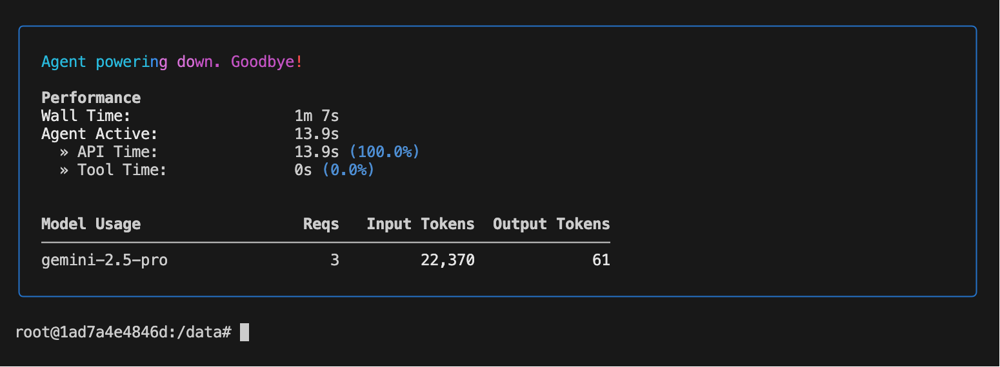

# ai-terminal-home

> 一个基于 Docker 的 AI 开发沙盒环境，集成了 Claude Code AI 和 Gemini CLI 工具链

## 功能特点

- 🐳 基于 Ubuntu 22.04 的轻量级 Docker 容器
- 🤖 预装 Claude Code AI 和 Gemini CLI
- 🛡️ 安全的沙盒环境，保护宿主机系统
- 💾 通过卷挂载实现数据持久化
- 🚀 开箱即用的开发环境
- 🛠️ 完善的管理脚本，简化日常操作
- 🔄 支持代理配置，方便网络访问

## 目的

因为 AI 执行命令的时候，需要将代码运行在沙盒环境。我们需要构建一个基于 Ubuntu 22.04 的镜像的沙盒环境。

让 claudecode 在自己的沙盒环境下运行，避免一些危险命令破坏工作环境。

通过挂载宿主机的数据目录，实现数据持久化。基于沙盒环境中 AI 生成的数据，可以保存在宿主机的数据目录中。

在宿主机可以通过 IDE 访问沙盒环境中的文件，实现代码的编辑和调试。即控制了 AI 的运行环境，又可以方便的访问 AI 生成的数据和程序。

## 快速开始

### 先决条件

- Docker 20.10.0 或更高版本
- Docker Compose 2.0.0 或更高版本
- Git（可选，用于克隆仓库）

### 克隆仓库

```bash
git clone https://github.com/yourusername/ai-terminal-home.git
cd ai-terminal-home
```

### 配置环境变量

复制示例环境变量文件并修改：

```bash
cp .env.example .env
```

编辑 `.env` 文件，设置以下变量：

```ini
# Claude API 配置
ANTHROPIC_BASE_URL=https://api.moonshot.cn/anthropic/
ANTHROPIC_AUTH_TOKEN=your_claude_api_key

# Gemini API 配置
GEMINI_API_KEY=your_gemini_api_key

# 代理设置（如果需要）
HTTPS_PROXY=http://127.0.0.1:7890
HTTP_PROXY=http://127.0.0.1:7890
ALL_PROXY=socks5://127.0.0.1:7890

# 时区设置
TZ=Asia/Shanghai
```

## 使用管理脚本 (推荐)

我们提供了一个 `ai-terminal.sh` 脚本来简化常见操作：

```bash
# 添加执行权限
chmod +x ai-terminal.sh

# 查看帮助
./ai-terminal.sh help

# 构建镜像
./ai-terminal.sh build

# 启动容器
./ai-terminal.sh start

# 停止容器
./ai-terminal.sh stop

# 重启容器
./ai-terminal.sh restart

# 查看容器状态
./ai-terminal.sh status

# 查看容器日志
./ai-terminal.sh logs

# 更新容器（拉取最新代码并重建）
./ai-terminal.sh update

# 进入容器 shell
./ai-terminal.sh shell

# 查看已安装工具的版本
./ai-terminal.sh versions
```

## 工具使用指南

### Claude Code AI

Claude Code 是一个强大的 AI 编程助手，可以帮助你编写、调试和优化代码。

```bash
# 启动 Claude Code 交互式会话
claude

# 使用 Claude Code 分析代码
claude analyze /path/to/your/code
```

### Gemini CLI

Gemini CLI 是 Google 的 AI 工具，提供代码生成和对话功能。

```bash
# 启动 Gemini 交互式会话
gemini

```



### Tmux 终端复用

Tmux 允许你在单个终端窗口中创建多个终端会话，并在它们之间轻松切换。

```bash
# 创建新会话
tmux new -s session_name

# 附加到现有会话
tmux attach -t session_name

# 列出所有会话
tmux ls

# 分离当前会话（在 tmux 中按 Ctrl+b 然后按 d）

# 关闭会话
tmux kill-session -t session_name
```

## 开发

### 构建镜像

```bash
docker-compose build
```

### 启动开发环境

```bash
docker-compose up -d
```

### 进入容器

```bash
docker-compose exec ai-terminal-home bash
```

## 故障排除

### 容器启动失败

1. 检查 Docker 是否正在运行
2. 检查端口是否被占用
3. 查看容器日志：`./ai-terminal.sh logs`

### 网络连接问题

如果遇到网络问题，请检查代理设置：

1. 确保 `.env` 文件中的代理设置正确
2. 如果不需要代理，请删除或注释掉相关环境变量

## 贡献

欢迎提交 Issue 和 Pull Request。

## 许可证

[MIT](LICENSE)
