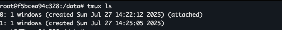
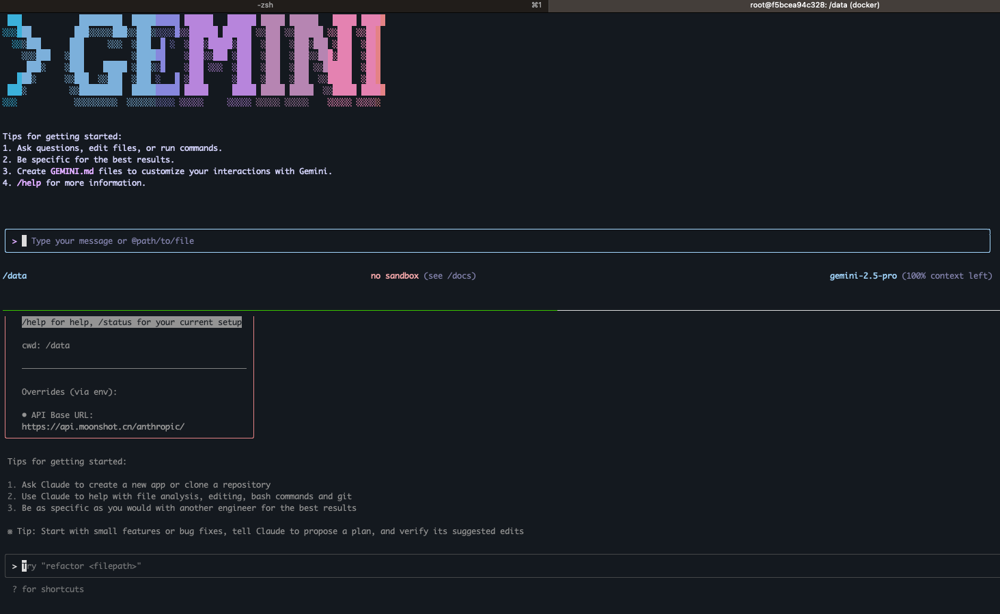

# ai-terminal-home

> 一个基于 Docker 的 AI 开发沙盒环境，集成了 Claude Code AI 和 Gemini CLI 工具链

## 功能特点

- 🐳 基于 Ubuntu 22.04 的轻量级 Docker 容器
- 🤖 预装 Claude Code AI 和 Gemini CLI
- 🛡️ 安全的沙盒环境，保护宿主机系统
- 💾 通过卷挂载实现数据持久化
- 🚀 开箱即用的开发环境
- 🛠️ 完善的管理脚本，简化日常操作
- 🔄 支持代理配置，方便网络访问
- 📦 提供预构建的 Docker 镜像，支持快速部署

## 快速开始

### 方式一：使用预构建镜像（推荐）

1. 从 Docker Hub 拉取并运行最新镜像：
   ```bash
   # 拉取并运行最新版本
   VERSION=0.0.1 docker-compose -f docker-compose.pull.yaml up -d
   
   # 或者指定版本
   VERSION=0.0.1 docker-compose -f docker-compose.pull.yaml up -d
   ```

2. 访问容器：
   ```bash
   docker exec -it ai-terminal-home bash
   ```

### 方式二：从源码构建镜像

1. 克隆仓库：
   ```bash
   git clone https://github.com/yourusername/ai-terminal-home.git
   cd ai-terminal-home
   ```

2. 构建并启动容器：
   ```bash
   # 构建并启动
   docker-compose up -d --build
   
   # 查看日志
   docker-compose logs -f
   ```

3. 访问容器：
   ```bash
   docker exec -it ai-terminal-home bash
   ```

### 环境变量配置

在 `.env` 文件中设置以下环境变量：

```ini
# API 密钥
ANTHROPIC_AUTH_TOKEN=your_api_key_sk
GEMINI_API_KEY=your_gemini_api_key

# 代理设置
https_proxy=http://127.0.0.1:7890
http_proxy=http://127.0.0.1:7890
all_proxy=socks5://127.0.0.1:7890
```

## 管理命令

### 启动/停止容器

```bash
# 启动
./ai-terminal.sh start

# 停止
./ai-terminal.sh stop

# 重启
./ai-terminal.sh restart
```

### 查看日志

```bash
# 查看日志
./ai-terminal.sh logs

# 实时查看日志
./ai-terminal.sh logs -f
```

### 其他命令

```bash
# 查看容器状态
./ai-terminal.sh status

# 更新容器
./ai-terminal.sh update

# 查看已安装工具版本
./ai-terminal.sh versions
```

## 使用 tmux 管理会话

### 查看 tmux 会话

在容器中，您可以使用 tmux 来管理多个终端会话。以下是查看当前 tmux 会话的命令：

```bash
tmux ls
```



### 运行 Gemini 和 Claude Code

您可以在 tmux 中同时运行 Gemini 和 Claude Code：

1. 启动 tmux：
   ```bash
   tmux new -s ai
   ```

2. 分割窗口：
   - 水平分割：`Ctrl+b "`
   - 垂直分割：`Ctrl+b %`

3. 在不同面板中分别运行：
   - Gemini: `gemini`
   - Claude Code: `claude`



### 常用 tmux 命令

- 创建新窗口：`Ctrl+b c`
- 切换窗口：`Ctrl+b 窗口号`
- 分离会话：`Ctrl+b d`
- 重新连接会话：`tmux attach -t ai`
- 列出会话：`tmux ls`
- 结束会话：`tmux kill-session -t ai`

## 构建和发布

### 构建新版本

1. 更新版本号：
   ```bash
   # 在 docker-compose.pull.yaml 中更新 VERSION 变量
   VERSION=0.0.2
   ```

2. 构建并推送镜像：
   ```bash
   # 构建镜像
   ./ai-terminal.sh build
   
   # 推送镜像到 Docker Hub
   ./push-image.sh -u your_dockerhub_username -v 0.0.2
   ```

## 常见问题

### 如何更新到最新版本？

```bash
# 停止并删除旧容器
docker-compose -f docker-compose.pull.yaml down

# 拉取并启动新版本
VERSION=最新版本号 docker-compose -f docker-compose.pull.yaml up -d
```

### 如何查看容器日志？

```bash
docker-compose -f docker-compose.pull.yaml logs -f
```

## 许可证

MIT License
