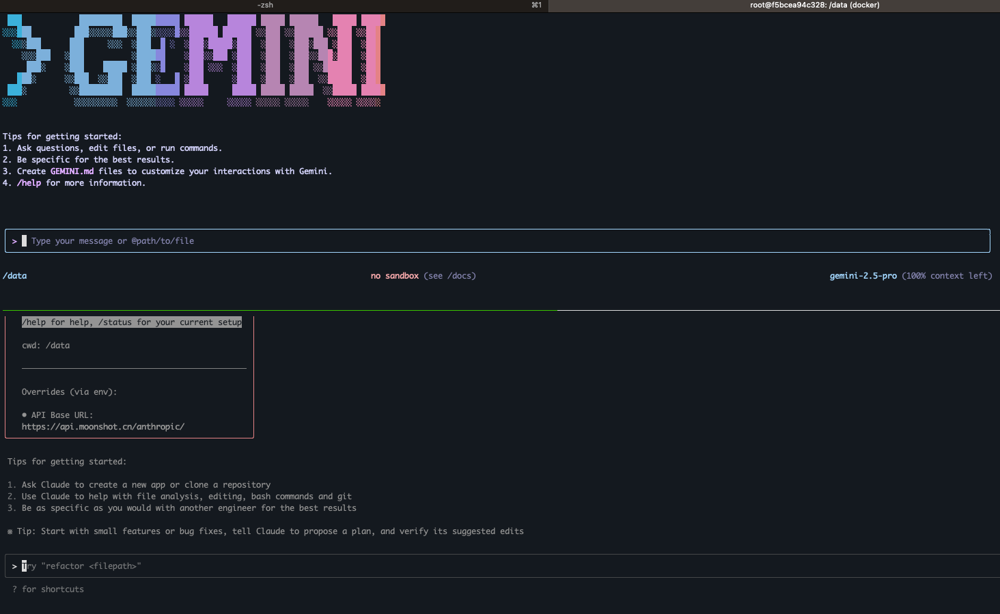

# AI Terminal Home

> A Docker-based AI development sandbox environment with integrated Claude Code AI and Gemini CLI toolchain

## Features

- 🐳 Lightweight Docker container based on Ubuntu 22.04
- 🤖 Pre-installed Claude Code AI and Gemini CLI
- 🛡️ Secure sandbox environment that protects the host system
- 💾 Data persistence through volume mounting
- 🚀 Ready-to-use development environment
- 🛠️ Comprehensive management script for daily operations
- 🔄 Proxy configuration support for network access
- 📦 Support for building from source or using pre-built Docker images

## Quick Start

### Method 1: Building from Source (Recommended)

1. Clone the repository:
   ```bash
   git clone https://github.com/yourusername/ai-terminal-home.git
   cd ai-terminal-home
   ```

2. Build and start the container:
   ```bash
   # Build and start
   ./ai-terminal.sh build
   ./ai-terminal.sh start
   
   # Or use docker-compose directly
   docker-compose --profile build up -d
   ```

3. Access the container:
   ```bash
   docker exec -it ai-terminal-home bash
   ```

### Method 2: Using Pre-built Images

1. Pull and run the latest image:
   ```bash
   # Pull and run the latest version
   VERSION=latest docker-compose --profile pull up -d
   
   # Or specify a version
   VERSION=0.0.1 docker-compose --profile pull up -d
   ```

2. Access the container:
   ```bash
   docker exec -it ai-terminal-home bash
   ```

## Environment Variables

Configure the following environment variables in the `.env` file:

```ini
# API Keys
ANTHROPIC_AUTH_TOKEN=your_api_key_sk
GEMINI_API_KEY=your_gemini_api_key

# Proxy Settings
https_proxy=http://127.0.0.1:7890
http_proxy=http://127.0.0.1:7890
all_proxy=socks5://127.0.0.1:7890
```

## Management Commands

### Start/Stop Containers

```bash
# Build the image
./ai-terminal.sh build

# Start
./ai-terminal.sh start

# Stop
./ai-terminal.sh stop

# Restart
./ai-terminal.sh restart
```

### View Logs

```bash
# View logs
./ai-terminal.sh logs
```

### Other Commands

```bash
# Check container status
./ai-terminal.sh status

# Update container (from source)
./ai-terminal.sh update

# Show installed tool versions
./ai-terminal.sh versions

# Show help
./ai-terminal.sh help
```

## Using tmux for Session Management

### Viewing tmux Sessions

Inside the container, you can use tmux to manage multiple terminal sessions. To view current tmux sessions, use:

```bash
tmux ls
```


### Running Gemini and Claude Code

You can run both Gemini and Claude Code simultaneously in tmux:

1. Start a new tmux session:
   ```bash
   tmux new -s ai
   ```

2. Split the window:
   - Horizontal split: `Ctrl+b "`
   - Vertical split: `Ctrl+b %`

3. Run in different panes:
   - Gemini: `gemini`
   - Claude Code: `claude`



### Common tmux Commands

- Create new window: `Ctrl+b c`
- Switch windows: `Ctrl+b [window number]`
- Detach session: `Ctrl+b d`
- Reattach session: `tmux attach -t ai`
- List sessions: `tmux ls`
- Kill session: `tmux kill-session -t ai`

## Building and Publishing

### Building a New Version

1. Update the version number:
   ```bash
   # Update VERSION in docker-compose.yaml
   VERSION=0.0.2
   ```

2. Build and push the image:
   ```bash
   # Build the image
   ./ai-terminal.sh build
   
   # Push the image to Docker Hub
   ./push-image.sh -u your_dockerhub_username -v 0.0.2
   ```

## FAQ

### How to update to the latest version?

```bash
# Stop and remove the old container
docker-compose down

# Pull the latest code
git pull

# Rebuild and start
./ai-terminal.sh update
```

### How to view container logs?

```bash
# View logs
./ai-terminal.sh logs

# Follow logs in real-time
./ai-terminal.sh logs -f
```

## License

MIT License
