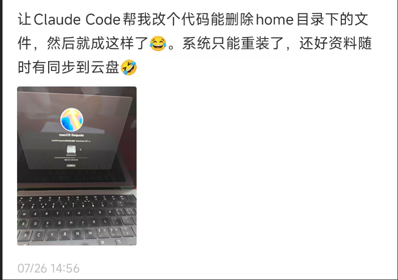

# 🚀 安全第一：AI Terminal Home - 安全的AI开发沙盒环境


## 🔍 项目背景与开发目的

随着AI工具的普及，越来越多的开发者开始使用AI辅助编程。然而，直接在本地环境执行AI生成的命令存在严重的安全风险：

- 恶意代码可能破坏系统文件
- 敏感数据可能被意外泄露
- 系统配置可能被意外修改

比如这个新闻： [八天心血，一键删光：AI 擅自执行 db:push，数据没了](https://mp.weixin.qq.com/s?__biz=MjM5MTQzNzU2NA==&mid=2651738507&idx=1&sn=6561c8a3cc47dc8aed2b6e74063e720b&from=singlemessage&subscene=10000&clicktime=1753488900&enterid=1753488900&sessionid=0&ascene=1&fasttmpl_type=0&fasttmpl_fullversion=7835612-zh_CN-zip&fasttmpl_flag=0&realreporttime=1753488900998&scene=21&poc_token=HG8chmijBwq3M-BcuJGfA_DBf3qMMi5fSi7V-yv_)




**AI Terminal Home 应运而生**，它是一个基于 Docker 的安全沙盒环境，为AI辅助编程提供隔离的运行空间，让开发者能够安全地测试和运行AI生成的命令。

## 🛡️ 安全特性

- **完全隔离**：所有操作都在容器内执行，与宿主机完全隔离
- **资源限制**：限制容器的CPU、内存使用，防止资源滥用
- **只读文件系统**：关键系统目录设置为只读，防止意外修改
- **网络隔离**：默认限制容器网络访问，保护本地网络环境
- **数据持久化**：通过挂载卷管理数据，容器销毁后数据不会丢失

## 🛠️ 快速开始

```bash
# 1. 克隆项目
git clone https://github.com/xmx0632/ai-terminal-home.git
cd ai-terminal-home

# 2. 构建镜像
./ai-terminal.sh build

# 3. 启动容器
./ai-terminal.sh start
```

## 🎯 为什么需要AI开发沙盒？

### 1. 防止系统损坏
AI工具可能会建议执行`rm -rf /`等危险命令，在沙盒环境中执行可以避免对真实系统造成损害。

### 2. 保护隐私数据
沙盒环境与主机隔离，可以防止AI工具意外访问或泄露敏感信息。

### 3. 环境一致性
确保开发环境一致，避免"在我机器上能运行"的问题。

## 🔒 安全建议

1. **定期更新**：保持Docker和基础镜像为最新版本
2. **最小权限**：不要使用root用户运行容器
3. **数据备份**：重要数据定期备份
4. **监控日志**：定期检查容器日志，发现异常行为

## 💡 结语

AI Terminal Home 致力于为开发者提供一个安全、可靠的AI开发环境。我们相信，通过正确的工具和最佳实践，可以充分发挥AI辅助编程的潜力，同时将风险降到最低。

**安全开发，从隔离环境开始！** 